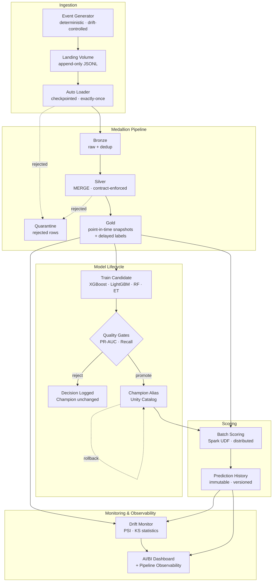

# Telco Churn — a production-style data platform on Databricks


[](https://github.com/myraidtaoai/databricks-churn-platform/actions/workflows/ci.yml)

A batch data platform that ingests simulated customer events, refines them through a Bronze/Silver/Gold medallion into point-in-time feature snapshots, and serves a governed churn model on top of them. Every stage is deployed as a Databricks Asset Bundle, governed by Unity Catalog, and released through GitHub Actions with PAT authentication. Model candidates are gated against the incumbent Champion on objective metric thresholds and promoted only when they win; every score ever produced is retained in an immutable, model-versioned prediction history, and the Champion can be rolled back with a single command. Feature and prediction drift are monitored via PSI and KS statistics, and pipeline health is tracked through an observability dashboard.

The point of this repository is the operational surface, not the model. It is built to answer *"how would you run a machine learning system in production?"* rather than *"how do you train a model?"*

## Architecture



Full diagram, layer contracts, design decisions, and the failure/recovery matrix: **[docs/architecture.md](docs/architecture.md)**.

The medallion stage of that flow has two implementations against the same Bronze tables: the PySpark jobs in `src/churn_pipeline/transformation/`, and an equivalent dbt project in `dbt_project/`. Ingestion and the model lifecycle stay in PySpark, since file I/O, Auto Loader checkpoints, MLflow, and Spark UDF scoring are not SQL problems.

## Dashboard


View the full dashboard PDF →
[Data Exploraton and Model Results](outputs/Telco-Churn-Exploration-Model-Results.pdf)
[Pipeline Observability](outputs/Pipeline-Observability.pdf)


## What this demonstrates

| Capability | How | Where |
|---|---|---|
| Infrastructure as code | Schema, Volume, experiment, registered model, dashboards, and nine jobs declared in one bundle | `databricks.yml`, `resources/churn_workflow.yml` |
| CI/CD with PAT auth | Lint, test, and bundle validation on PR; auto-deploy to dev on merge; SHA-pinned, approval-gated prod | `.github/workflows/` |
| Governed data and models | Unity Catalog schema, managed Volume, registered model with aliases | `resources/churn_workflow.yml` |
| Objective model promotion | PR-AUC improvement and recall-degradation thresholds; rejection is a logged outcome, not a failure | `src/churn_pipeline/modeling/promotion_policy.py`, `promote.py` |
| Auditable scoring | Append-only `prediction_history` tagged with model version and run ID; `current_customer_churn_scores` is a view over it | `src/churn_pipeline/modeling/score.py` |
| Safe rollback | Validates version, inference contract, and metrics before restoring the alias; appends a `ROLLBACK` event | `src/churn_pipeline/modeling/rollback.py` |
| Distributed inference | MLflow Spark UDF — no `toPandas()` collection to the driver, enforced by a regression test | `src/churn_pipeline/modeling/inference.py`, `mlflow_compat.py` |
| Versioned inference contract | Scoring refuses an incompatible Champion instead of silently producing wrong output | `src/churn_pipeline/modeling/inference.py` |
| Idempotent, replayable ETL | Deterministic keys, `MERGE` upserts, date-windowed backfill; same input always yields same output | `src/churn_pipeline/ingestion/`, `transformation/` |
| Data quality with quarantine | Three-tier severity (fail/quarantine/warn); bad rows routed to quarantine, not dropped silently | `src/churn_pipeline/transformation/quality.py` |
| Drift monitoring | PSI and KS statistics per feature and for predictions; alerts at 0.10/0.25 thresholds | `src/churn_pipeline/monitoring/drift.py`, `monitor.py` |
| Pipeline observability | Every task logs status, duration, and output summary; AI/BI dashboard tracks runs, quality, and drift | `src/churn_pipeline/ops/run_logger.py`, `dashboards/` |
| Scheduled production pipeline | Event generation daily 5 AM, data + scoring daily 6 AM, model retraining 1st & 15th monthly | `resources/churn_workflow.yml` |
| Reproducible synthetic data | Same date + seed + drift level yields byte-identical events; conflicting rewrites are rejected | `src/churn_pipeline/ingestion/generate_events.py` |
| Model explainability | SHAP over a held-out sample, published to a table the dashboard reads | `src/churn_pipeline/modeling/train.py` |
| Tested | 19 test modules, 167 tests covering ETL idempotency, quality, drift, promotion, inference contract, bundle/dashboard contracts | `tests/` |
| Declarative transformations | The same Bronze→Silver→Gold logic expressed a second time in dbt — incremental MERGE, Jinja-generated window features, schema tests, generated lineage docs | `dbt_project/` |

## Roadmap

The platform is being hardened along a documented plan: **[plans/implementation-plan.md](plans/implementation-plan.md)**.

- [x] Asset Bundles, Unity Catalog, dev/prod targets
- [x] CI/CD with PAT auth and approval-gated production
- [x] Quality-gated promotion, alias rollback, immutable prediction history
- [x] Distributed inference with a versioned contract
- [x] Deterministic event generator with controlled drift
- [x] Idempotent, replayable ETL — deterministic keys, `MERGE`, date-windowed backfill
- [x] Auto Loader incremental ingestion — checkpointed, exactly-once
- [x] Data quality with quarantine — three-tier severity (fail/quarantine/warn)
- [x] Versioned data contract enforced in code — shared by producer and consumer
- [x] Point-in-time features and delayed labels — leakage prevention proven by test
- [x] Pipeline observability — run logging, data quality metrics, AI/BI dashboard
- [x] Drift monitoring — PSI + KS statistics, standalone job, dashboard widgets
- [x] Scheduled production pipeline — event gen, data + scoring, biweekly retraining
- [x] dbt transformation layer — the medallion expressed declaratively, alongside the PySpark implementation

## Deliberate non-goals

- **Real-time serving.** Churn scores drive a daily retention campaign. Sub-second latency buys nothing and costs a continuously running endpoint. The `availableNow` batch trigger is the right tool; streaming becomes correct when a consumer acts on individual events in seconds.
- **Real customer data.** The source is the public Telco Customer Churn dataset plus a deterministic event simulator. Synthetic generation is a feature here: it makes drift controllable, backfills unlimited, and the whole pipeline reproducible by anyone who clones the repo.
- **Automated retraining on drift.** Drift raises an alert. It does not silently promote a new model — that is how you ship a bad model quickly.
- **Multi-tenant catalog design and cost attribution.** Out of scope at this size; sketched in the plan appendix.

---

## Running it

<details>
<summary><b>Deploy</b></summary>

Authenticate the Databricks CLI, then validate and deploy the development target:

```bash
databricks auth login --host <workspace-url>
databricks warehouses list
databricks bundle validate -t dev --var="warehouse_id=<warehouse-id>"
databricks bundle deploy -t dev --var="warehouse_id=<warehouse-id>"
```

Deployment packages the repository CSV and creates the schema and `landing` Volume. Run `churn_seed_bronze` once to copy the packaged CSV to the resolved Volume path. This correctly handles the schema prefix that development mode adds, so no manual `databricks fs cp` command is required.

Pushes to `main` that pass CI are automatically validated and deployed to Dev. Production deployment is manual, accepts only a commit SHA that passed the Dev deployment, and uses the protected `prod` GitHub environment for approval. Both stages authenticate with a Personal Access Token stored in GitHub Secrets. Complete the one-time environment configuration in [Deployment and identity setup](docs/deployment.md).

Override variables to use another catalog or schema. Use the same values for deploy and run:

```bash
databricks bundle deploy -t dev --var="warehouse_id=<warehouse-id>" --var="catalog=my_catalog" --var="schema=churn_alex"
databricks bundle run churn_data_pipeline -t dev --var="warehouse_id=<warehouse-id>" --var="catalog=my_catalog" --var="schema=churn_alex"
```

</details>

<details>
<summary><b>Run the workflows</b></summary>

Run the complete workflow with one command:

```bash
databricks bundle run churn_end_to_end -t dev --var="warehouse_id=<warehouse-id>"
```

Generate a reproducible daily customer-event batch in the managed landing Volume:

```bash
databricks bundle run churn_event_generator -t dev --var="warehouse_id=<warehouse-id>" --params event_date=2026-08-02,seed=20260801,drift_level=0.0
```

The generator reads the validated `telco_silver` snapshot and writes append-only JSONL under `landing/events/year=YYYY/month=MM/day=DD`. The same date, seed, and drift level always produce the same event IDs and payload; an identical rerun is a no-op, while a conflicting rewrite is rejected. Increase `drift_level` from `0.0` toward `1.0` to simulate more payment failures, support calls, complaints, plan changes, cancellations, higher charges, and reduced usage. See [Customer event generation](docs/event-generation.md) for the data contract, drift behavior, and verification query.

To seed the Bronze table with the historical CSV (one-time, idempotent):

```bash
databricks bundle run churn_seed_bronze -t dev --var="warehouse_id=<warehouse-id>"
```

For targeted reruns or troubleshooting, run the stage workflows in dependency order. The data pipeline starts with Auto Loader event ingestion (incremental, checkpointed, exactly-once):

```bash
databricks bundle run churn_data_pipeline -t dev --var="warehouse_id=<warehouse-id>"
databricks bundle run churn_model_pipeline -t dev --var="warehouse_id=<warehouse-id>"
databricks bundle run churn_batch_score -t dev --var="warehouse_id=<warehouse-id>"
```

To backfill features and labels for a historical date:

```bash
databricks bundle run churn_backfill_features -t dev --var="warehouse_id=<warehouse-id>" --params as_of_date=2026-06-15
```

To compute feature and prediction drift metrics against the training baseline:

```bash
databricks bundle run churn_drift_monitor -t dev --var="warehouse_id=<warehouse-id>"
```

To roll the Champion alias back to a previously validated registered-model version, run the manual rollback job with the target version:

```bash
databricks bundle run churn_model_rollback -t dev --var="warehouse_id=<warehouse-id>" --params target_version=<model-version>
```

Rollback validates the model version, inference contract, and immutable candidate metrics before changing the alias. It verifies the new alias and appends a `ROLLBACK` event to `model_promotion_history`; it never edits model metrics or prediction tables.

The first deployment of the versioned inference contract must run the model pipeline before batch scoring. Training logs a probability-producing MLflow `pyfunc` model, promotion replaces a legacy Champion only when model quality is preserved, and batch scoring rejects an incompatible Champion instead of silently producing incorrect output.

</details>

<details>
<summary><b>dbt transformation layer</b></summary>

The medallion transformations exist twice in this repository, deliberately. `src/churn_pipeline/transformation/` implements them imperatively in PySpark; `dbt_project/` implements the same logic declaratively in dbt. Neither replaces the other — running both against the same Bronze tables is what makes the comparison legible.

| PySpark | dbt model | What changes |
|---|---|---|
| `transform.py` (select/cast) | `stg_telco_bronze` | Column renames become a staging view |
| `transform.py` (MERGE + quality) | `telco_silver` | 40 lines of table-exists checks and hand-written MERGE collapse into `materialized='incremental'` |
| `transform.py` (Gold aggregate) | `churn_summary` | Unchanged in substance |
| `build_features.py` | `gold_feature_snapshot` | Repeated 7/30/90-day window blocks become Jinja loops |
| `generate_labels.py` | `gold_labels`, `training_dataset` | Delayed labels and the training view |
| `quality.py` rules | `schema.yml` tests | Imperative rule engine becomes declarative YAML |

dbt reads Bronze but never creates it. `telco_bronze` and `telco_events_bronze` come from the bundle jobs, so deploy and seed before running dbt:

```bash
databricks bundle deploy -t dev --var="warehouse_id=<warehouse-id>"
databricks bundle run churn_seed_bronze -t dev --var="warehouse_id=<warehouse-id>"
```

Then:

```bash
export DBT_DATABRICKS_HOST="<workspace-host>"        # bare hostname, no https://
export DBT_DATABRICKS_HTTP_PATH="/sql/1.0/warehouses/<warehouse-id>"
export DBT_DATABRICKS_TOKEN="<token>"

cd dbt_project
dbt deps
dbt run
dbt test
dbt docs generate && dbt docs serve
```

Catalog and schema resolve from the profile target. Source tables are deliberately decoupled from it via the `source_catalog` and `source_schema` variables, so dbt writes to a personal development schema while always reading Bronze from the schema the bundle deployed.

Full setup, model-by-model notes, and troubleshooting: **[dbt_project/README.md](dbt_project/README.md)**.

</details>

<details>
<summary><b>The model</b></summary>

The training task compares `BalancedRandomForestClassifier`, XGBoost, LightGBM, and Extra Trees. It uses a stratified train/validation/test split, applies each model's appropriate class-imbalance method, and selects the candidate with the best validation PR-AUC. It picks a classification threshold from validation data and publishes PR-AUC, ROC-AUC, precision, recall, F1, and balanced accuracy for the dashboard. It also calculates Shapley values on a representative held-out sample and writes global feature impact to `shap_feature_importance`.

PR-AUC rather than ROC-AUC is the selection metric because churn is imbalanced and the operational question is precision within the flagged population, not ranking across the whole base.

</details>

<details>
<summary><b>Tests</b></summary>

```bash
python -m pip install -r requirements-dev.txt
python -m pytest -v
```

The unit tests cover validation-threshold selection, production risk-segment boundaries, promotion guardrails, and the versioned probability-output contract. Regression tests verify distributed scoring remains free of driver-side Pandas collection, as well as Champion selection, metric ranges, portfolio completeness, risk ordering, and the published SHAP snapshot. These dependencies are for local testing only and are not installed into the Databricks serverless job environments.

</details>

<details>
<summary><b>Dashboard details</b></summary>

The bundle deploys two AI/BI dashboards:

**Churn Exploration & Model Results** (`dashboards/churn_exploration_and_model_results.lvdash.json`) — a continuous, PDF-friendly Churn Intelligence Report combining customer exploration with model evidence. It covers tenure, payment, contract patterns, risk segmentation, calibration, candidate trade-offs, SHAP explanations, and the high-risk action list.

**Pipeline Observability** (`dashboards/pipeline_observability.lvdash.json`) — operational dashboard tracking pipeline run history, data quality metrics, model promotion decisions, and feature/prediction drift alerts. Sources include `pipeline_runs`, `data_quality_metrics`, `model_promotion_history`, and `drift_metrics`.

A Power BI dashboard spec is also provided for connecting Power BI Desktop to the Databricks SQL warehouse via JDBC/ODBC. See [Power BI dashboard spec](docs/powerbi-dashboard-spec.md) for field mappings and visual configurations.

Run the workflow once before opening either dashboard, so the source tables exist. Dashboards are deployed as drafts; open them from **Dashboards**, verify the configured SQL warehouse, then publish when the data looks correct.

To pull an existing remote Databricks dashboard definition down into the local bundle (for example, after edits made in the Databricks UI), run:

```bash
databricks bundle generate dashboard -t dev --existing-id <dashboard-id>
```

Review the generated local dashboard file before redeploying it.

</details>

<details>
<summary><b>Compute, permissions, and Free Edition</b></summary>

Bronze and Silver use an untouched serverless environment-4 base. Training and scoring use a separate environment that installs only the missing ML libraries. NumPy, pandas, SciPy, scikit-learn, PyArrow, and Databricks Connect come from the coherent Databricks base environment and must not be reinstalled in a task or notebook. This separation exists so that compiled ML wheels cannot break Spark Connect initialization in the ETL path.

The bundle is configured for Free Edition's serverless-only compute. The end-to-end job invokes the stage jobs sequentially and does not require a custom VM type or cluster configuration. Free Edition compute is quota-limited and is intended for learning and non-commercial projects. Free Edition also has constrained Model Serving capacity, so a real-time API endpoint should be treated as optional experimentation rather than the primary delivery mechanism.

The identity running `bundle deploy` needs permission to create a schema, managed Volume, registered model, dashboard, and an MLflow experiment directly in its workspace home. The workflow run identity needs `READ VOLUME` and `WRITE VOLUME` on the landing Volume and permission to create or replace tables in the deployed schema.

Three jobs are scheduled in production: the event generator runs daily at 5 AM (Toronto), the end-to-end orchestrator (data pipeline + batch scoring) runs daily at 6 AM, and the model pipeline retrains on the 1st and 15th of each month at 7 AM. All schedules are active (`UNPAUSED`) in the prod target. The dev target inherits the same schedule definitions but Databricks development mode prevents them from firing automatically.

</details>

<details>
<summary><b>Troubleshooting</b></summary>

- `dashboard warehouse_id is required`: pass `--var="warehouse_id=<warehouse-id>"` to `bundle validate`, `bundle deploy`, and `bundle run`.
- `Parent directory does not exist` while creating the experiment: deploy the latest bundle. The experiment now lives directly in `/Users/<deployer>/<bundle>-<target>-churn-training`, whose parent already exists.
- `spark should be initialized with the first notebook command`: use the committed Python tasks, which explicitly create a serverless `DatabricksSession`; do not replace that helper with a notebook-injected global `spark`.
- `numpy.dtype size changed`: deploy the latest bundle and start a completely new workflow run—not a repair of the failed run. Verify `ingest_events` and `transform_silver_and_gold` use `etl_v4`, which has no added dependencies. Do not install or upgrade NumPy, pandas, SciPy, scikit-learn, PyArrow, or Databricks Connect from a notebook cell.
- `InvalidVersion: Invalid version: '18.x-aarch64-photon-scala2'`: deploy the latest bundle and start a new `churn_batch_score` run. The scorer contains a narrow MLflow 2.22 compatibility retry for Free Edition's uncut Databricks Runtime 18 image label.
- Landing-file errors: deploy the latest bundle and start a new run. The CSV is synchronized to `${workspace.file_path}/data` and automatically copied into the resolved `/Volumes/<catalog>/<deployed-schema>/landing` path. Confirm the run identity has `WRITE VOLUME`.

</details>

## Documentation

| Document | Contents |
|---|---|
| [Architecture](docs/architecture.md) | Full diagram, layer contracts, design decisions, failure/recovery matrix |
| [Implementation plan](plans/implementation-plan.md) | Current-state audit, phased tasks with acceptance criteria, execution order |
| [dbt project](dbt_project/README.md) | Setup, model layout, materializations, tests, PySpark↔dbt mapping |
| [Event generation](docs/event-generation.md) | Simulation contract, landing layout, drift behavior |
| [Deployment](docs/deployment.md) | PAT auth and environment setup |

## Author

**Jianhong Wen** — Data Engineer

**LinkedIn**: [https://www.linkedin.com/in/jianhong-wen-279a3b3a4/](https://www.linkedin.com/in/jianhong-wen-279a3b3a4/)